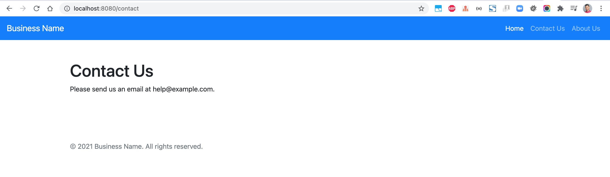

# thymeleaf-layout-sample

### Things todo list:

1. Clone this repository: `git clone https://github.com/hendisantika/thymeleaf-layout-sample.git`
2. navigate to the folder: `cd thymeleaf-layout-sample`
3. Run the application: `mvn clean spring-boot:run`
4. Open your favorite browser: http://localhost:8080

### Images Screenshot

Home Page

Contact Page

About Page

